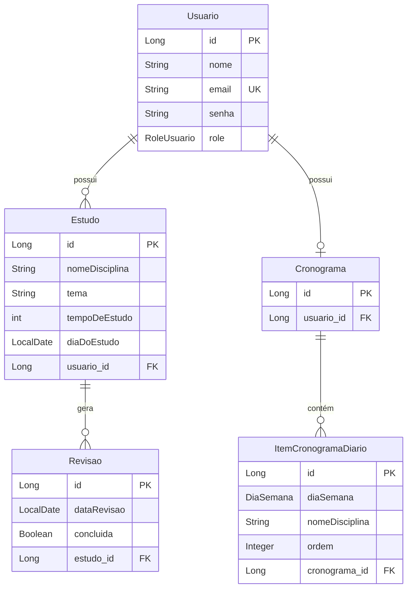
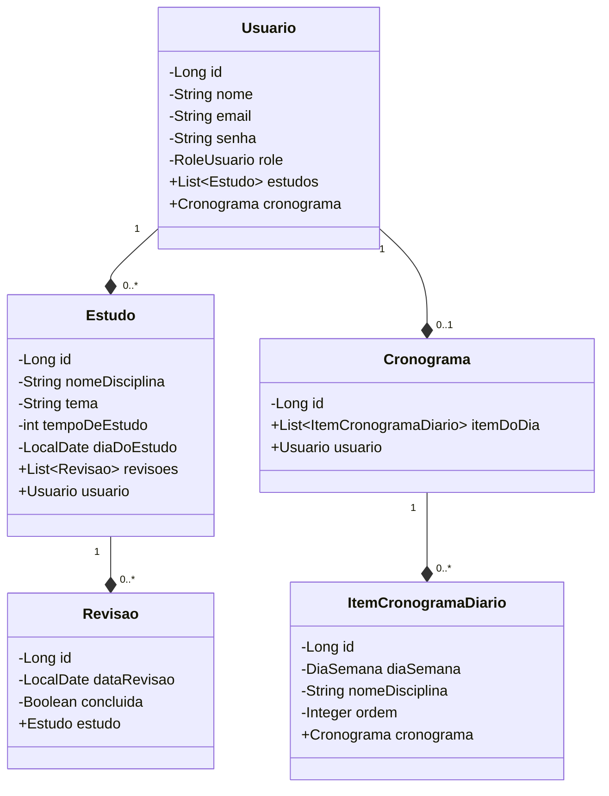

# CronoStudy - Sistema de Gerenciamento de Estudos

Sistema web completo para organização de estudos com revisão espaçada. Desenvolvido para a disciplina de **Linguagens de Programação** na UFC Quixadá. Permite aos usuários criar cronogramas de estudos, registrar sessões diárias e gerenciar revisões periódicas automaticamente.

## Funcionalidades

### Cronograma
- Criação de cronograma personalizado
- Adição de itens em lote ou individualmente
- Reorganização por arrastar/soltar
- Movimentação de itens entre dias
- Exportação para PDF
- Exclusão do cronograma
- Alteração de nome dos itens
- Reorganização da ordem dos itens dentro do dia

### Estudos
- Cadastro de estudos realizados no dia
- Edição de dados (exceto data)
- Exclusão de estudo
- Listagem paginada
- Cada estudo cria automaticamente revisões periódicas (1, 7 e 14 dias após)

### Revisões
- Revisões automáticas (D+1, D+7, D+14) para cada estudo
- **Calendário** - Mostra revisões para cada dia no formato de calendário
- **Revisões Pendentes** - Revisões agendadas para o dia atual
- **Revisões Atrasadas** - Revisões não concluídas até o dia anterior
- **Revisões Concluídas** - Histórico de revisões finalizadas
- Modal com dados detalhados ao clicar em uma revisão
- Botões para concluir e reagendar nas listagens de pendentes e atrasadas

### Relatórios
- Disciplina mais estudada
- Top 5 disciplinas
- Estudos por dia (linha do tempo)
- Gráficos de distribuição de horas por disciplina
- Quantidade de estudos realizados
- Disciplinas concluídas
- Tempo total estudado
- Média diária
- Visão geral das disciplinas estudadas
- Exportação completa para PDF

## Arquitetura do Sistema

### Modelagem de Dados



## Stack Tecnológica

### Backend (Java/Spring Boot)
- **Java 17** + Spring Boot 3.5.7
- **Spring Security** com JWT Authentication
- **PostgreSQL** + Spring Data JPA/Hibernate
- **Spring Validation** + Lombok
- **Arquitetura MVC** com DTOs
- **Paginação** em todas as listagens
- **API RESTful** completa

### Frontend (Vue 3 + TypeScript)
- **Vue 3** com Composition API + TypeScript
- **Vuetify** para interface moderna
- **Pinia** para gerenciamento de estado
- **Vue Router** para navegação
- **Axios** para requisições HTTP
- **Chart.js** para gráficos
- **Date-fns** para manipulação de datas
- **Yup** para validação
- **jsPDF** para exportação em PDF

## Instalação e Execução

### Pré-requisitos
- Java 17+
- Node.js 20+
- PostgreSQL 14+
- Maven 3.8+

### Passo a Passo

#### 1. Banco de Dados
```sql
CREATE DATABASE cronostudy;
-- As tabelas serão criadas automaticamente pelo Hibernate
```

#### 2. Configurar Backend
```bash
cd backend/AuxiliarRotinaEstudo

# Configurar application.properties:
# spring.datasource.url=jdbc:postgresql://localhost:5432/cronostudy
# spring.datasource.username=seu_usuario
# spring.datasource.password=sua_senha

mvn clean install
mvn spring-boot:run
```
**API disponível em:** `http://localhost:8080`

#### 3. Configurar Frontend
```bash
cd frontend/AuxiliarRotinaEstudo

npm install
npm run dev
```
**Aplicação disponível em:** `http://localhost:5173`

## Estrutura do Projeto

```
CronoStudy/
├── backend/
│   ├── src/main/java/
│   │   ├── controller/     # Controladores REST
│   │   ├── service/        # Lógica de negócio
│   │   ├── repository/     # Acesso a dados
│   │   ├── model/          # Entidades e DTOs
│   │   └── configuration/  # Configuração do sistema
│   └── application.properties
│
└── frontend/
    ├── src/
    │   ├── views/          # Páginas Vue
    │   ├── composables/    # Componentes reutilizáveis
    │   ├── stores/         # Gerenciamento de estado Pinia
    │   ├── api/            # Comunicação com API
    │   ├── utils/          # Componentes uteis
    │   └── router/         # Configuração de rotas
    └── package.json
```

## Entidades do Sistema



## Segurança
- Autenticação JWT com refresh token
- Tokens com expiração configurável
- Validação em backend e frontend
- Proteção contra XSS e injeção SQL
- CORS configurado para ambiente de desenvolvimento

## Características Técnicas
- **Páginação** em todas as listagens
- **Validação** em tempo real
- **Feedback visual** para ações do usuário
- **Design responsivo** (mobile-friendly)
- **Persistência otimizada** com JPA
- **Código limpo** seguindo boas práticas
- **Documentação** completa da API

## Interfaces do Usuário
- **Dashboard intuitivo** com métricas visuais
- **Calendário interativo** para revisões
- **Formulários validados** em tempo real
- **Modais contextuais** para ações
- **Notificações toast** para feedback
- **Temas claros/escuros**

## Relatórios de Desempenho
- Tempo total de estudo
- Média diária por período
- Disciplina mais estudada
- Taxa de conclusão de revisões
- Distribuição semanal de estudos
- Progresso ao longo do tempo

## Autor
**Luis Gomes**  
- GitHub: [@Lusigmes](https://github.com/Lusigmes)
- Email: talkme.lusi@gmail.com

---

*Sistema desenvolvido com foco em produtividade e eficiência no aprendizado através da técnica de revisão espaçada.*
